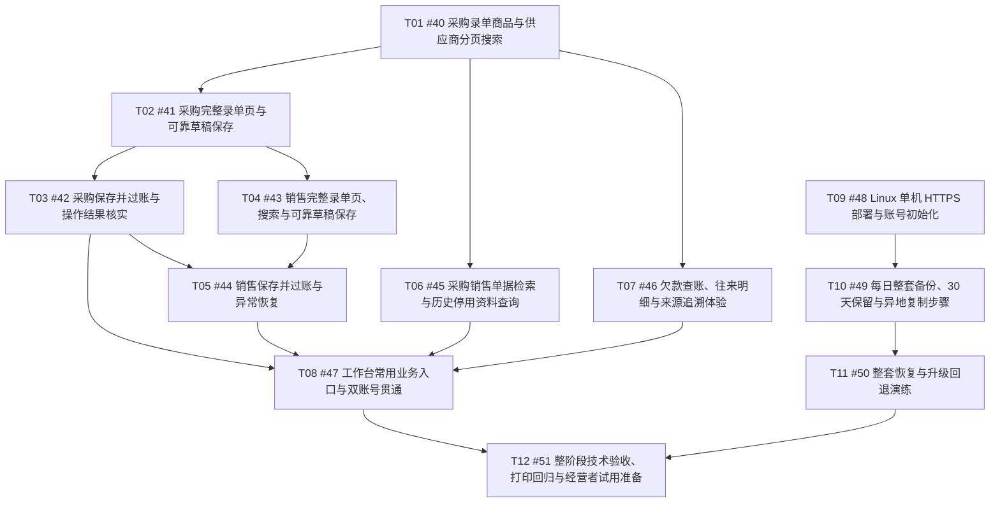

# Phase 5 实现任务索引

规格：[GitHub #39](https://github.com/EziosWJ/simple-inventory/issues/39) · [本地规格](../phase-5-spec.md)。需求讨论：[Q1～Q22](../phase-5-plan.md)。

状态：用户已确认拆分，由 gpt-6-luna 按依赖顺序发布为 GitHub #40～#51，全部标记 ready-for-agent。12 项正文/标签与 15 条原生 blocked-by 关系已核验；T01～T12 保留为本地拆分编号，表中提供真实 issue。

## 拆分清单

| 编号 | 任务 | Blocked by | 独立交付 |
| --- | --- | --- | --- |
| T01 / [#40](https://github.com/EziosWJ/simple-inventory/issues/40) | [采购录单商品与供应商分页搜索](01-purchase-search.md) | 无 | 经营者在现有采购录单入口按商品资料或供应商联系方式搜索并选择正确对象，资料超过 500 条仍能完整检索；首个可用场景同时建立后续复用的选择能力。 |
| T02 / [#41](https://github.com/EziosWJ/simple-inventory/issues/41) | [采购完整录单页与可靠草稿保存](02-purchase-form-drafts.md) | [#40](https://github.com/EziosWJ/simple-inventory/issues/40) | 经营者在独立采购录单页新建或编辑草稿，清晰核对商品和合计；网络中断后能确认原保存结果，重试不重复建单，双人编辑不会相互覆盖。 |
| T03 / [#42](https://github.com/EziosWJ/simple-inventory/issues/42) | [采购保存并过账与操作结果核实](03-purchase-save-post.md) | [#41](https://github.com/EziosWJ/simple-inventory/issues/41) | 经营者核对整张采购单后直接保存并过账；保存失败不入账，过账失败留下同一草稿，响应丢失时展示实际状态并安全重试。 |
| T04 / [#43](https://github.com/EziosWJ/simple-inventory/issues/43) | [销售完整录单页、搜索与可靠草稿保存](04-sale-form-drafts.md) | [#41](https://github.com/EziosWJ/simple-inventory/issues/41) | 经营者搜索客户和实物/服务，在完整销售页填写交付资料并可靠保存草稿；共享采购场景验证过的选择和保存体验，同时保留销售与直送语义。 |
| T05 / [#44](https://github.com/EziosWJ/simple-inventory/issues/44) | [销售保存并过账与异常恢复](05-sale-save-post.md) | [#42](https://github.com/EziosWJ/simple-inventory/issues/42)、[#43](https://github.com/EziosWJ/simple-inventory/issues/43) | 经营者直接确认销售并保存过账；库存不足留下原草稿，纯服务与零金额正常生效，网络中断和双人竞争不会重复出库或记应收。 |
| T06 / [#45](https://github.com/EziosWJ/simple-inventory/issues/45) | [采购销售单据检索与历史停用资料查询](06-document-query.md) | [#40](https://github.com/EziosWJ/simple-inventory/issues/40) | 经营者按单号、交易对象、商品、状态和业务日期查采购/销售单，能找到停用及身份变化前的历史业务，从详情返回时保留查询条件。 |
| T07 / [#46](https://github.com/EziosWJ/simple-inventory/issues/46) | [欠款查账、往来明细与来源追溯体验](07-partner-query.md) | [#40](https://github.com/EziosWJ/simple-inventory/issues/40) | 经营者快速找到往来单位，分别看客户与供应商欠款，从余额进入正确方向和期间的明细，再追溯来源单据及返回查账上下文。 |
| T08 / [#47](https://github.com/EziosWJ/simple-inventory/issues/47) | [工作台常用业务入口与双账号贯通](08-workbench-accounts.md) | [#42](https://github.com/EziosWJ/simple-inventory/issues/42)、[#44](https://github.com/EziosWJ/simple-inventory/issues/44)、[#45](https://github.com/EziosWJ/simple-inventory/issues/45)、[#46](https://github.com/EziosWJ/simple-inventory/issues/46) | 两名经营者分别登录后能在工作台直接开采购/销售单、查欠款或查单据，访问同一店铺业务，并保留各自实际操作人。 |
| T09 / [#48](https://github.com/EziosWJ/simple-inventory/issues/48) | [Linux 单机 HTTPS 部署与账号初始化](09-production-compose.md) | 无 | 维护者在隔离 Linux 环境用生产 Compose 启动内嵌前端的 API、PostgreSQL 和 HTTPS 代理，执行显式迁移，准备两名账号并验证持久性。 |
| T10 / [#49](https://github.com/EziosWJ/simple-inventory/issues/49) | [每日整套备份、30 天保留与异地复制步骤](10-daily-backups.md) | [#48](https://github.com/EziosWJ/simple-inventory/issues/48) | 生产部署包每天自动生成数据库、上传文件和必要配置的一致备份，识别成功或失败，保留 30 天并可按说明复制到另一设备或存储。 |
| T11 / [#50](https://github.com/EziosWJ/simple-inventory/issues/50) | [整套恢复与升级回退演练](11-restore-upgrade.md) | [#49](https://github.com/EziosWJ/simple-inventory/issues/49) | 维护者将已验证备份恢复到新的数据库和持久目录，实际启动应用并核对业务/文件，再演练升级失败时恢复发布前数据及旧应用。 |
| T12 / [#51](https://github.com/EziosWJ/simple-inventory/issues/51) | [整阶段技术验收、打印回归与经营者试用准备](12-phase5-acceptance.md) | [#47](https://github.com/EziosWJ/simple-inventory/issues/47)、[#50](https://github.com/EziosWJ/simple-inventory/issues/50) | 交付已贯通的 Phase 5 技术验收证据、真实打印回归和父母代表性业务试用材料，明确技术、恢复与人工试用各自状态。 |

## 依赖图

## 推进规则

- 当前技术前沿：T01 / [#40](https://github.com/EziosWJ/simple-inventory/issues/40)、T09 / [#48](https://github.com/EziosWJ/simple-inventory/issues/48)。部署最终版本的交付安排仍在录单、查询之后。
- 阶段顺序是录单与搜索（T01～T05）→ 查询与首页（T06～T08）→ 部署与备份恢复（T09～T11）→ 贯通验收与试用准备（T12）。它表达用户确认的推进顺序，不将每个前序任务都机械添加为技术阻塞。
- T02 随采购完整页交付共用的草稿请求/恢复约定；T04 基于它交付销售，T03 首先验证保存并过账的共用交互，T05 接入销售。
- 查询切片使用已交付的选择能力，不因最终工作台尚未完成而被反向阻塞；依赖按上表维护，正文与发布后的原生关系必须一致。
- 任务按完整用户行为拆分，不单独建数据库、API、UI 或大范围前置重构任务。schema/API/UI 只在该切片实际需要时变更，保留已有业务与客户端兼容。
- 两数据库、Swagger、真实认证/菜单、事务审计、设计模式及门禁要求以父规格为准；各任务先定向验证，定型后集中门禁，不对纯文档更改运行业务门禁。
- 每项均已标 ready-for-agent。T12 的技术验收和试用材料可以由 agent 交付；父母真实试用仍单独记录，未执行不得声称通过，阶段正式验收需核对人工结果。
- 本次新建 12 项实现任务及原生 blocked-by 关系；父规格及旧 Phase 4 issue 正文和状态未改动。

## 发布确认

用户已确认“按此拆分使用 gpt6luna 发布”。gpt-6-luna 已完成发布，主代理同步本地编号与文档；每项正文、ready-for-agent 标签及完整原生依赖均通过核验。发布不代表功能实现完成。

## 已确认规划覆盖

| 访谈决定 | 规格/任务覆盖 |
| --- | --- |
| Q1～Q7：使用目标、两名经营者、电脑、录单查询及云端目标 | 父规格问题、方案、用户故事及范围；T02、T04、T08、T09、T12 |
| Q8、Q11：搜索、表单清楚及历史停用资料 | T01、T02、T04、T06、T07 |
| Q9：欠款/往来与单据检索 | T06、T07 |
| Q10：独立账号、共享业务及真实执行人 | T02、T04、T08、T09、T12 |
| Q12、Q15：完整页、保存草稿与保存并过账 | T02～T05 |
| Q13：首页四类入口 | T08 |
| Q14：可部署版本、隔离验收，正式上线另行安排 | T09～T12 |
| Q16、Q17：失败核实、安全重试与双人冲突 | T02～T05、T12 |
| Q18、Q19：PostgreSQL、Linux 单机 Compose 和 HTTPS | T09、T11 |
| Q20：每日整套备份、保留 30 天、复制步骤及真实恢复 | T10、T11 |
| Q21：阶段顺序与暂缓范围 | 索引推进规则及父规格 Out of Scope |
| Q22：浏览器/双库/PDF/部署恢复和父母试用 | 各切片定向验证，T12 汇总技术证据并单列人工状态 |

## 发布核验

- 父规格：#39；实现任务：#40～#51，共 12 项，发布模型为 gpt-6-luna。
- 正文与批准稿一致，所有 Blocked by 使用真实 issue；全部 ready-for-agent 标签核对通过。
- 共 15 条原生 blocked-by 关系逐项 GET 核对，和正文、表格及依赖图一致；#40、#48 无阻塞。
- 发布轮次只完成规格、任务发布及文档同步，发布不代表实现完成；后续本地技术实施及门禁结果见 [Phase 5 进度](../phase-5-progress.md) 和 [技术验收记录](../phase-5-acceptance.md)。父母实际试用单独记录，GitHub issue 状态仍以线上为准。
